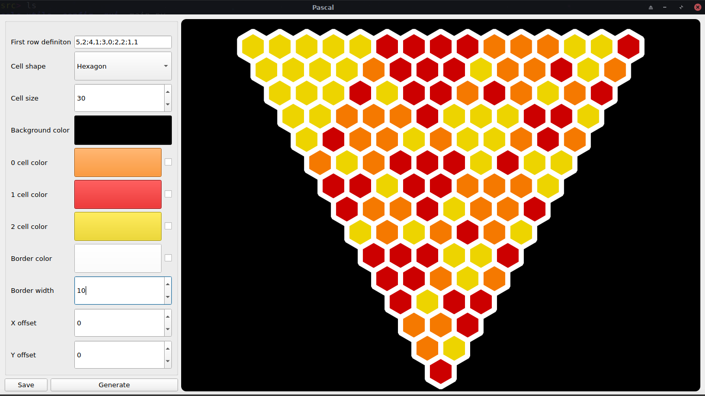
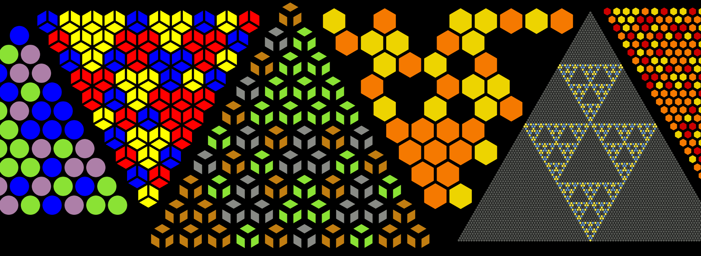

# Colorful Pascal's triangle
Pascal's triangle on steroids. It's a small program written in python using Qt5, inspired with a [Mathologer](https://www.youtube.com/channel/UC1_uAIS3r8Vu6JjXWvastJg)'s youtube [video](https://www.youtube.com/watch?v=9JN5f7_3YmQ). Program allows the user to generate triangles similar to those in the video. User can specify different properties:
- How the first row looks like
- Background color
- Cells shape, size and color
- Edges color and width
- etc.

## First row definition
Sometimes triangles can be very big (contain a lot of cells in the top row). Writing the definition is a simple way of specifing how triangle will look like, without the need of setting the color of each cell separately.  

#### Definiton can be composed of several things:
- Cell numbers `0 1 2`
- Random cell number `r`
- Separators `, ;`
- And just simple numbers

#### Definition examples:
- `000111222` 3 cells of some color, 3 of other and 3 of other
- `rrr` 3 random cells
- `10,r` 10 random cells (same as `rrrrrrrrrr`)
- `12;3,r;21` 12 cells, 3 random and 21 (same as `12rrr21`)
- `5,2;4,1;3,0` (same as `222221111000`)

## Examples and UI
UI may look diferent depending on OS you're using and its configuration

